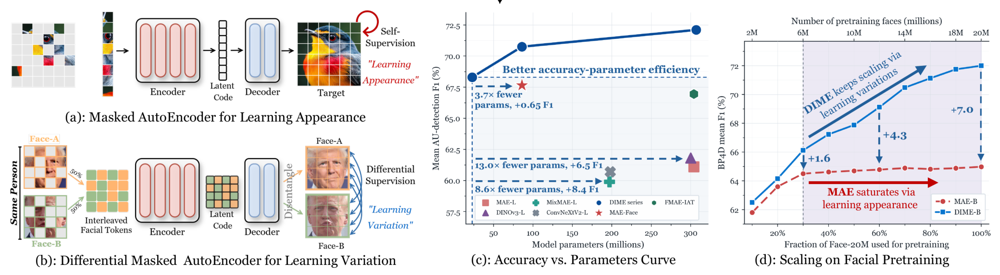
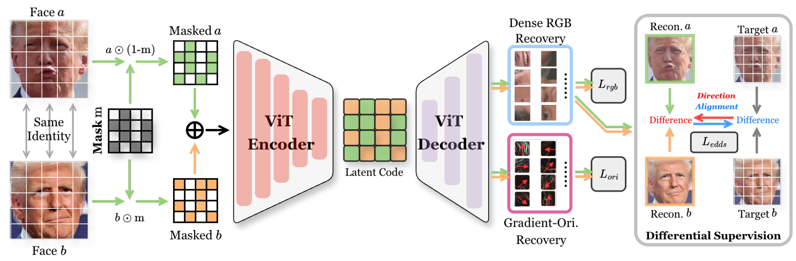

# DIME: Scaling Facial Representation Learning via Differential Masked Autoencoding



DIME learns facial representations by reconstructing same-identity image pairs
and supervising the direction of their differences. This repository provides ViT
pretraining and downstream code for head pose, landmarks, and face parsing.
See the [project page](https://cv-ac.github.io/DIME_page/) for results.

**Pretrained weights and [AU-TOOLBOX](AU/README.md): coming soon.**

## Demos

https://github.com/user-attachments/assets/decb1568-6403-448b-9403-0e188d04a249


Panels: input, head pose, landmarks, face parsing,
and action units.

## Method



Reciprocal token mixing and source-isolated attention reconstruct both faces.
EDDS complements RGB reconstruction and gradient-orientation recovery.
Only the encoder is retained for downstream tasks.

## Getting started

Requires Python 3.10+. Install PyTorch and torchvision for your accelerator, then:

```bash
python -m pip install -e .
```

### Pretraining

The face dataset used for pretraining is coming soon.
All pretraining configurations default to 8 nodes with 8 GPUs per node (64 GPUs).
To submit a Slurm job:

```bash
python scripts/submit_slurm.py \
  --account YOUR_ACCOUNT --partition YOUR_PARTITION \
  --nodes 8 --gpus-per-node 8 \
  -- --model base --data /path/to/pretrain.lmdb
```

Configurations: [Small](DIME_VIT/configs/vit_small_patch16.yaml) ·
[Base](DIME_VIT/configs/vit_base_patch16.yaml) ·
[Large](DIME_VIT/configs/vit_large_patch16.yaml).
Training runs for 400 epochs at 224, then 100 at 512, with automatic checkpoint
resume. Use `--opts` for configuration overrides.
The repository, Python environment, data, and output directory must be accessible
from every node.

### Downstream training

Set data and pretrained-checkpoint paths in the task configuration.
`FACEBENCH_DATA_ROOT` can set the root containing `datasets/`,
`landmark_dataset/`, and `parsing_dataset/`.

| Task | Configuration |
|---|---|
| Head pose | [300W-LP → AFLW2000-3D / BIWI](DIME_face_low_level/facebench/facebench/tasks/head_pose/configs/dime.yaml) |
| Landmarks | [WFLW](DIME_face_low_level/facebench/facebench/tasks/landmark/configs/wflw/dime_full.yaml) |
| Face parsing | [LaPa](DIME_face_low_level/facebench/facebench/tasks/parsing/configs/lapa/dime.yaml) · [CelebAMask-HQ](DIME_face_low_level/facebench/facebench/tasks/parsing/configs/celebamask_hq/dime.yaml) |

```bash
python -m facebench.tasks.head_pose.train \
  --config DIME_face_low_level/facebench/facebench/tasks/head_pose/configs/dime.yaml

python -m facebench.tasks.landmark.train \
  --config DIME_face_low_level/facebench/facebench/tasks/landmark/configs/wflw/dime_full.yaml

python -m facebench.tasks.parsing.train \
  --config DIME_face_low_level/facebench/facebench/tasks/parsing/configs/lapa/dime.yaml
```

### Using the encoder

```python
from DIME_VIT.encoder import load_encoder

encoder = load_encoder("outputs/dime_vit_base_patch16/checkpoint-latest.pth")
pooled = encoder(images)
features = encoder.forward_intermediates(images)
```

Normalize inputs with `encoder.image_mean` and `encoder.image_std`.

## Citation

```bibtex
@article{yu2026dime,
  title={DIME: Scaling Facial Representation Learning via Differential Masked Autoencoding},
  author={Yu, Hao and Chen, Haoyu and Wei, Hui and Jiang, Yan and Sebe, Nicu and Zhao, Guoying},
  year={2026}
}
```

## Acknowledgments and licensing

Built on [FaRL](https://github.com/FacePerceiver/FaRL) and
[6DRepNet](https://github.com/thohemp/6DRepNet).
Figures and video previews are from the manuscript and
[project page](https://cv-ac.github.io/DIME_page/).
See [THIRD_PARTY_NOTICES](THIRD_PARTY_NOTICES) for attributions and licenses.
The project's original code is released under the [Apache License 2.0](LICENSE).
Third-party components keep their own licenses.
